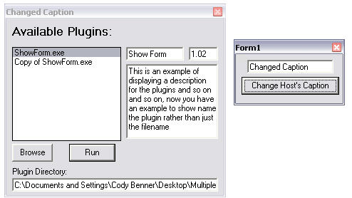



## Multiple Plugins \(updated\)

### Description

This is my update of Shane Reidy's "Multiple Plugins" This is his code and does all that it did except i added examples how to interact with the Main App and added an option to choose where the plugins are located.
 
### More Info
 

             |
---                |---
**Submitted On**   |2003-04-06 11:55:54
**By**             |[Stryksta Guy](https://github.com/Planet-Source-Code/PSCIndex/blob/master/ByAuthor/stryksta-guy.md)
**Level**          |Intermediate
**User Rating**    |5.0 (20 globes from 4 users)
**Compatibility**  |VB 5\.0, VB 6\.0
**Category**       |[OLE/ COM/ DCOM/ Active\-X](https://github.com/Planet-Source-Code/PSCIndex/blob/master/ByCategory/ole-com-dcom-active-x__1-29.md)
**World**          |[Visual Basic](https://github.com/Planet-Source-Code/PSCIndex/blob/master/ByWorld/visual-basic.md)
**Archive File**   |[Multiple\_P157019462003\.zip](https://github.com/Planet-Source-Code/stryksta-guy-multiple-plugins-updated__1-44561/archive/master.zip)

